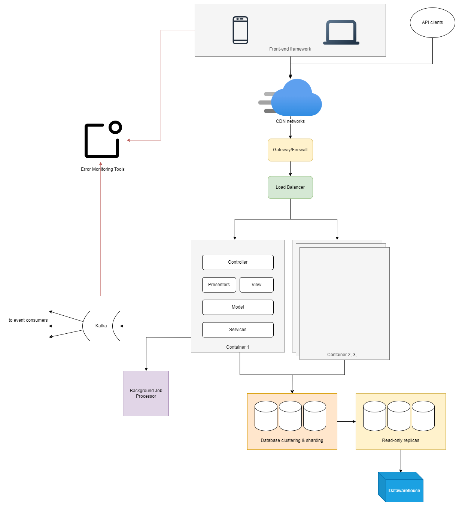

# Part 02

This is a simplified diagram of a system architecture that I would design for a hypothetical complex web application.

The monolith is deployed on the cloud, horizontally-scalable, with load balancer distributing the loads, and gateway acting as a form of firewall/protection.
CDN is also utilised to reduce network latency.

The end users comprises of mobile users, desktop users, and API clients. The mobile and desktop users are served the frontend application running modern framework.

The application has background jobs running to service any long-running requests, or requests that can be done asynchronously, or automated.

It also emits a series of event streams to the broker to be relayed to any event consumers.

The database is designed so that it is highly-available, and optimised to serve the high traffic.
There is also replicas to help with any reporting needs, and there is also datawarehouse for business intelligence needs.

All errors on both backend and frontend are sent to external monitoring and alerting tools

PS. diagram is drawn using https://app.diagrams.net/ with [this source file](./system_arch.drawio)